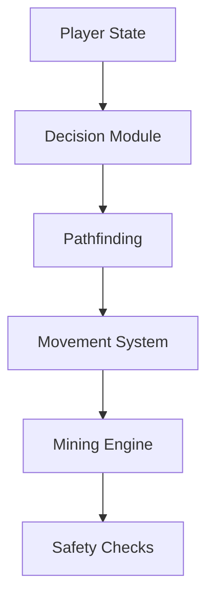

# Minecraft Auto-Miner Bot (v2.0)

> **Note**
> This branch contains **release v2.0**, a major architectural refactor of the project.  
> The old, stable and fully working **version (v1.0)** is available on the **release v1.0** branch.

---

## Overview

The **Minecraft Auto-Miner Bot** is a fully autonomous mining bot built on top of the **MineScript** mod.
It is designed to safely and efficiently mine resources underground while reacting to hazards such as lava,
hostile entities, low health, or movement stalls.

This project focuses on:

- Reliability during long mining sessions
- Clear separation between decision-making and execution
- Safe automation with automatic recovery and restart logic

The bot is modular, extensible, and designed similarly to real-world robotics and game AI systems.

---

## Requirements

- Minecraft (Fabric / Forge / NeoForge)


MineScript can be downloaded from:

- [https://modrinth.com/mod/minescript](https://modrinth.com/mod/minescript)
- [https://www.curseforge.com/minecraft/mc-mods/minescript](https://www.curseforge.com/minecraft/mc-mods/minescript)

---

## Installation

1. Install **MineScript** for your Minecraft version
2. Launch Minecraft once to generate the `minescript` folder
3. Copy this [/bot](/bot) folder into:

   ```
   # Before
   .minecraft/minescript/

   # After
   .minecraft/minescript/bot
   ```

4. Ensure the folder structure matches the project layout

---

## Usage

### Start the Bot

From the Minecraft chat, type:

```
\bot\main
```

### Available Commands

Type these commands in chat:

```
.bot <mode>      # Commands usage
```

```
.bot auto        # Start full autonomous mining
.bot descend     # Only descend to target Y-level
.bot scan        # Scan ores without mining
.bot restart     # Restart the bot safely
.bot stop        # Stop current bot jobs
.bot stop all    # Stop all MineScript jobs including main
.bot help        # Show help commands
```

---

## Notes & Warnings

- Designed for **single-player or controlled environments**
- Use at your own risk on multiplayer servers
- Automatic safety logic may interrupt/stop mining when hazards are detected

---

## System Architecture


The architecture is split into two layers:

- **Core systems**: low-level execution and sensing
- **Modes**: high-level behaviors composed from core systems

---

## Features

### Autonomous Mining

- Automatically descends to a target Y-level (default: **Y = -58**)
- Scans for nearby ore clusters
- Prioritizes and mines the best reachable cluster
- Repeats the process indefinitely

### Safety & Hazard Detection

- Lava detection in the surrounding area
- Hostile entity detection
- Health monitoring
- Tool and weapon state detection
- Automatic shutdown or recovery when danger is detected

### Stuck Detection & Recovery

- Detects lack of positional progress over time
- Differentiates between being stuck and slow mining
- Attempts local recovery before restarting
- Automatically restarts the bot if recovery fails

### Modular Command System

- Chat-based command interface (`.bot <mode>`)
- Run, stop, or restart modes without restarting Minecraft
- Supports isolated testing modes

---

## Algorithms & Techniques

### Shell / Frontier Expansion Search

Instead of rescanning entire regions repeatedly, the bot explores only the boundary between known and unknown blocks.
This significantly reduces redundant checks and improves performance.

### Ore Clustering

Detected ore blocks are grouped into clusters based on spatial proximity.
Clusters are scored and prioritized instead of mining single blocks blindly.

### Reachability Filtering

Before committing to a cluster, the bot verifies that it is physically reachable
based on current terrain and player position.

### Path Mining (unsing A\* algorithm)

The bot mines a clear path toward the target cluster, ensuring:

- Stable footing
- Proper floor placement
- Centered player movement

### Autonomous Restart Logic

If the bot becomes irrecoverably stuck or encounters unsafe conditions,
it safely shuts down current jobs and restarts a fresh execution cycle.

---

## Project Structure

```
bot/
├── core/        # Low-level systems (movement, safety, mining, decision)
├── modes/       # High-level behaviors (auto, descend, scan)
├── test/        # Isolated test scripts
├── docs/        # Architecture diagrams
└── main.py      # Entry point
```

### Core Systems (`bot/core`)

| File               | Responsibility                                            |
| ------------------ | --------------------------------------------------------- |
| `player.py`        | Player state tracking (position, velocity, health, tools) |
| `movement.py`      | Movement primitives and path execution                    |
| `mining.py`        | Block breaking and cluster mining                         |
| `decision.py`      | Cluster scoring and selection                             |
| `safety_mining.py` | Hazard handling and emergency logic                       |
| `constants.py`     | Physics, timings, thresholds                              |

### Modes (`bot/modes`)

| Mode      | Description                                   |
| --------- | --------------------------------------------- |
| `descend` | Safely mines down to target Y-level           |
| `scan`    | Scans and reports ore clusters without mining |
| `auto`    | Fully autonomous mining loop                  |

---

## Author

**SH1FTEDWASTAKEN**  
Computer Science student  
GitHub: [https://github.com/sh1ftedwastaken](https://github.com/sh1ftedwastaken)  
YouTube: [https://www.youtube.com/@sh1ftedwastaken](https://www.youtube.com/@sh1ftedwastaken)

Making projects just for fun! :D

%%%%%%%%%%%%%%%%%%%%%%%%%%%%%%%%%%%%%%%%%%%%%%%%%%%%%%%%%%%%%%%%%%%%%%%%%%%%%%%%%%%%%%%%%%%%%%%%%%%%

```markdown
# 🛰️ Minecraft Auto-Miner Bot (v2.0)

> **Elite Engineering Edition**
> This branch contains **release v2.0**, a major architectural refactor of the project. 
> The stable version 1.0 is available on the release v1.0 branch.

---

## 📌 Requirements

| Component | Version |
|---------|--------|
| Minecraft | Fabric/Forge/NeoForge |
| MineScript | 4.0+ ([Modrinth](https://modrinth.com/mod/minescript) / [CurseForge](https://www.curseforge.com/minecraft/mc-mods/minescript)) |
| Python | 3.9+ |

---

## ⚠️ Notes & Warnings

- 🧪 **Educational Use Only**: This bot demonstrates autonomous agent logic and spatial pathfinding.
- 🚨 **Safety Disclaimer**: Use at your own risk. Automatic safety logic may interrupt mining when hazards are detected.
- 📌 **Ethical Use**: Designed for single-player or controlled environments only 😉.

---

## 🧠 System Architecture


### 🔄 Core Pipeline



### 🧬 Multi-Threaded Perception System

- **State Thread**: Tracks player position/health/tools
- **Tool Thread**: Manages block-breaking prioritization
- **Hazard Thread**: Detects lava/entities/low health
- **Watchdog Thread**: Monitors system stability

---

## 🛠️ Quick-Start

### 📦 Installation

1. Install MineScript 4.0+ for your Minecraft version
2. Place the `bot/` folder in:

```
.minecraft/minescript/bot/
```

3. Launch Minecraft to initialize the mod/REW0 

### 💬 Chat Commands

| Command | Description |
|--------|-------------|
| `.bot auto` | Full autonomous mining with safety checks |
| `.bot descend` | Controlled Y-level descent to -58 |
| `.bot scan` | Resource mapping without block breaking |
| `.bot restart` | Safe shutdown and restart sequence |
| `.bot stop` | Pause all mining operations |
| `.bot help` | Show this command list |

---

## 🧪 Algorithmic Deep-Dive

### 🧭 Pathfinding

- **A* Algorithm**: 3D-to-2D grid projection with:
  - 32-block scanning radius (frontier expansion)
  - 24-block path buffer
  - 0.05s tick interval

### 🧱 Ore Clustering

**Priority Score Formula**:

$$\text{Score} = (\text{Cluster Size} \times 2.3) - (\text{Distance} \times 1.5)$$

- Groups blocks within 1.5 units distance
- Prioritizes larger clusters closer to the player

### 👁️ Perception System

- **Multi-threaded architecture**:
  - State tracking
  - Tool management
  - Hazard detection
  - Watchdog monitoring

---

## 📁 Project Structure

```bash
bot/
├── core/        # Core execution systems
│   ├── player.py        # State tracking
│   ├── movement.py      # Path execution
│   ├── mining.py        # Block interaction
│   ├── decision.py      # Cluster selection
│   ├── safety_mining.py # Hazard detection
│   └── constants.py     # Game physics rules
├── modes/       # Behavior implementations
│   ├── descend.py       # Y-level descent logic
│   ├── auto_miner.py    # Full mining automation
│   └── scan_only.py     # Resource scanning mode
└── main.py      # Entry point
```

---

## 🛡️ Safety Systems

- **Lava Avoidance**: Monitors Y=-59 to Y=-56
- **Water Bucket Clutch**: Uses slot 4 for mitigation
- **Health Thresholds**: Emergency shutdown at MIN_HEALTH = 10
- **Automatic Recovery**: Uses food items from slot 5

---

## 📊 Production Configuration

| Constant | Default Value | Description |
|---------|---------------|-------------|
| PICKAXE_SLOT | 1 | Primary mining tool inventory position |
| STOP_Y_LEVEL | -58 | Target Y-level for descent operations |
| MAX_SEARCHING_RADIUS | 32 | Maximum block radius for ore scanning |
| CLUSTER_DISTANCE_SCORE | 1.5 | Distance weight in cluster scoring formula |
| FALLING_Y_VEL | (-0.59, -3.92) | Velocity range indicating falling states |
| Y_LEVEL_LAVA_CHECK | (-59, -56) | Y-level range for lava detection |
| STUCK_TIMEOUT | 3s | Time without progress before recovery attempt |
| MAX_WALKING_VEL | 0.11786 | Maximum allowed walking speed |
| BLOCKS_AROUND_PLAYER | 12-block check grid | Blocks analyzed for terrain safety |
| INVALID_Y_LEVEL | (-60, -64) | Y-level range to avoid for safety |

---

## 🧪 Failure Recovery Systems

### 🔄 Stuck Detection Logic

- Monitors position changes every ONE_TICK_TIME = 0.05 seconds
- Triggers recovery if no movement for STUCK_TIMEOUT = 3 seconds

### 🚫 Hazard Mitigation

- **Lava Evasion**: Detects puddles at Y=-55
- **Emergency Protocols**: Shuts down at Y=-60 to -64 range
- **Food Recovery**: Uses slot 5 when health < 10

---

## 📌 Author & Credits

**SH1FTEDWASTAKEN**
Computer Science student | Open-Source Developer
GitHub: [https://github.com/sh1ftedwastaken](https://github.com/sh1ftedwastaken)
YouTube: [https://www.youtube.com/@sh1ftedwastaken](https://www.youtube.com/@sh1ftedwastaken)

▎ Making projects just for fun! :D
```