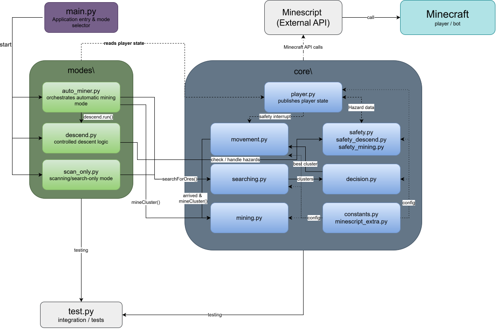
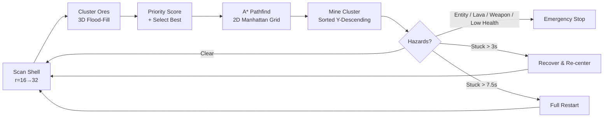

# 🛰️ Minecraft Auto-Miner Bot (v2.0)

> **Elite Engineering Edition** — Fully autonomous diamond-mining bot that navigates terrain, avoids lava, fights nothing, and never gets stuck.

> 📌 **Note:** Deep technical specifications, multi-threaded architecture, algorithmic details, and system architecture diagrams can be found in [./bot/docs/ARCHITECTURE.md](./bot/docs/ARCHITECTURE.md).

| ⚡ Autonomous Mining | 🛡️ Safety Systems | 🗺️ Smart Pathfinding | 🔄 Self-Recovery |
|---|---|---|---|
| Descends to Y=-58 automatically | Lava / water / fall / entity detection | A* on 2D projected walkability grid | Stuck detection + restart pipeline |
| Scans frontier-expanding shells | Water bucket clutch mid-fall | 3D flood-fill ore clustering | Job-aware process resurrection |
| Mines clusters by priority score | Weapon-drawn watchdog shutdown | Shell-expansion search (r=16→32) | `eat_food()` before relaunch |

> **One chat command. Zero input. Full automation.**
> Type `.bot auto` and watch an AI agent descend to diamond level, scan for ore veins, pathfind through rock, mine efficiently, and handle every hazard — completely unattended.

---

## 🎬 Quick Demo


*Caption: The bot descends to Y=-58, scans the frontier shell for diamond ore, clusters nearby blocks, A*-pathfinds to the best target, mines it, re-centers, and repeats — all in one continuous autonomous loop.*

---

## 📌 Requirements

| Component | Version | Notes |
|-----------|---------|-------|
| Minecraft | Any modern version | Works on Fabric, Forge, and NeoForge |
| MineScript | 4.0+ | [Modrinth](https://modrinth.com/mod/minescript) / [CurseForge](https://www.curseforge.com/minecraft/mc-mods/minescript) — install like any other mod |
| Python | 3.9+ | Bundled with MineScript — no separate install needed |

> **Minimal setup.** No modpack required. No external dependencies. Drop in two files and go.

---

## 🛠️ Quick-Start Installation

### Step 1: Install MineScript

Download MineScript 4.0+ from [Modrinth](https://modrinth.com/mod/minescript) or [CurseForge](https://www.curseforge.com/minecraft/mc-mods/minescript) and place it in your Minecraft `mods/` folder. Launch Minecraft once to generate the `minescript` directory.

### Step 2: Copy the Bot Folder

Copy the entire `bot/` folder from this repository into your Minecraft `minescript/` directory:

```
.minecraft/
├── minescript/
│   ├── bot/              ← Paste here
│   │   ├── main.py
│   │   ├── core/
│   │   ├── modes/
│   │   ├── test/
│   │   └── docs/
│   └── ... (other scripts)
├── mods/
│   └── minescript.jar
└── ...
```

### Step 3: Configure Hotbar Slots

> ⚠️ **Required** — the bot uses these specific hotbar slots. If your hotbar is arranged differently, the bot will grab the wrong items.

The bot was built with this hotbar layout:

```
1: Pickaxe   2: (anything)   3: Shovel       4: Water Bucket
5: Food      6: (anything)   7: (anything)   8: Blocks          9: (anything)
```

Open `bot/core/constants.py` and adjust these values to match **your** hotbar:

> ⚠️ **Note:** REMEMBER TO SUBTRACT 1 TO THE REAL SLOT NUMBER. Example: sword commonly goes in slot 1 (slot number), so subtract slow number by 1 and set 0 in the constant value. Slots numbers in minecraft are 1-indexed (1 - 9), while in the code they are 0-indexed (1 - 8).

| Constant | Default | Your Slot |
|----------|---------|-----------|
| `PICKAXE_SLOT` | `1` | The slot holding your pickaxe |
| `SHOVEL_SLOT` | `3` | The slot holding your shovel |
| `WATER_BUCKET_SLOT` | `4` | The slot with your water bucket |
| `FOOD_SLOT` | `5` | The slot with your food |
| `BLOCKS_SLOT` | `8` | The slot with placeable blocks (cobblestone, deepslate, etc.) |

### Step 4: Launch and Run

1. Launch Minecraft and join a world
2. Open chat (press `T`)
3. Type: `\bot\main`
4. You'll see: **Bot ACTIVATED**
5. Type: `.bot auto`

That's it. The bot will descend to diamond level and begin autonomous mining.

---

## 💬 Chat Commands

| Command | What It Does |
|---------|--------------|
| `.bot auto` | **Full autonomous mode** — descends, scans, mines, repeats. The main event. |
| `.bot descend` | **Safe descent only** — mines straight down to diamond level (Y=-58) with full hazard handling |
| `.bot scan` | **Resource scanner** — reports nearby ore clusters without mining anything |
| `.bot restart` | **Safe restart** — eat food, kill old jobs, relaunch auto-miner fresh |
| `.bot stop` | **Stop mining** — kills all running bot jobs except the main listener |
| `.bot stop all` | **Emergency kill** — kills EVERYTHING including the main listener |
| `.bot help` | **Show commands** — prints this list in Minecraft chat |


*Caption: Type `.bot auto` and the bot takes over — no keyboard input needed afterward.*

---

## 🎮 What the Bot Can Do

### The Scenario

You're at Y=40 in a new cave system. You have a diamond pickaxe, a water bucket, some food, and a stack of cobblestone. You type:

```
.bot auto
```

Here's what happens automatically:

1. **Descent** — The bot calibrates sprint, centers on its block, and mines straight down. It checks for lava below and water above. If it starts falling, it deploys a water bucket clutch mid-air. If it detects lava, it paths sideways. If it hits water, it block-escapes.

2. **Scan** — At Y=-58, it scans outward in expanding spherical shells (radius 16 → 20 → 24 → 28 → 32). Only the **frontier** between known and unknown space is checked — no redundant re-scanning.

3. **Cluster** — Detected diamond ore blocks are grouped into clusters using 3D flood-fill. Any ore within a 3×3×3 cube is considered one group.

4. **Score** — Each cluster gets a priority score. Clusters within 10 blocks use the formula `Score = 2.3 × Distance − 2.3 × Size` (lower wins, favoring large nearby clusters). Beyond 10 blocks, it picks the single largest cluster.

5. **Pathfind** — The bot projects the 3D terrain onto a 2D walkability grid, excludes lava blocks and their flow neighbors, and runs A* with Manhattan heuristic to find the shortest mineable path.

6. **Mine & Move** — It follows the path block by block, placing floor blocks when needed, re-centering on each coordinate, breaking ore in Y-descending order, and dealing with stuck situations.

7. **Repeat** — After mining a cluster, it re-centers and loops back to step 2 — forever, until you type `.bot stop` or a hazard triggers a safety shutdown.

> 🔬 **For complete algorithmic specifications — A* heuristic details, shell expansion math, cluster scoring derivations, and pipeline mermaid diagrams — see [./bot/docs/ARCHITECTURE.md](./bot/docs/ARCHITECTURE.md).**

### What It Won't Do

- ❌ Fight mobs (it stops if it sees one)
- ❌ Get stuck in loops (stuck > 3s = recovery, stuck > 7.5s = restart)
- ❌ Fall into lava (scanned before every step)
- ❌ Drain your tools (auto-swaps pickaxe/shovel based on block type)

---

## ⚠️ Notes & Warnings

- 🧪 **Educational Use Only**: This project demonstrates autonomous agent architecture, spatial pathfinding, and multi-threaded hazard perception.
- 🚨 **Safety Disclaimer**: Use at your own risk. Automatic safety logic may interrupt or halt mining when hazards are detected, but it cannot prevent all possible scenarios.
- 📌 **Ethical Use**: Designed for single-player or controlled environments.

---

## 📁 Project Structure

```bash
bot/
├── core/                     # Low-level execution and sensing
│   ├── __init__.py           # Instantiates PlayerTracker singleton (player)
│   ├── constants.py          # Physics, slots, Y-levels, scoring weights, item sets
│   ├── player.py             # PlayerTracker class — 4 daemon threads
│   ├── movement.py           # goToCenter, goToTarget, stuck_y, finalizeDescent
│   ├── mining.py             # mineCluster — sorted block breaking
│   ├── searching.py          # Shell-expansion 3D scan + flood-fill clustering
│   ├── decision.py           # Priority scoring, reachability filter, A* pathfinder
│   ├── safety_mining.py      # lavaSave — water bucket + block placement
│   ├── safety_descend.py     # waterDrop, closeToLava, inWater — descent hazards
│   ├── minescript_extra.py   # select_slot, tap_key, eat_food, kill_jobs, toggle_all
│   ├── restart.py            # Job-aware restart: eat_food → execute → kill old jobs
│   └── __old_functions.py    # Legacy implementations (reference only)
├── modes/                    # High-level behavioral routines
│   ├── auto_miner.py         # Full autonomous mining loop
│   ├── descend.py            # Controlled descent to STOP_Y_LEVEL
│   └── scan_only.py          # Read-only resource scanning and reporting
├── test/
│   └── test.py               # Module-level test harnesses
├── docs/
│   ├── ArchitectureDiagram.drawio.svg
│   └── ARCHITECTURE.md       # Full system architecture documentation
├── main.py                   # Entry point — chat command event loop
├── README.md                 # Original documentation (v1.0 style)
├── README2.md                # This file — v2.0 user documentation
└── LICENSE
```

---

## 🏗️ Architecture Diagram



> For a detailed breakdown of the 4-layer architecture — including the full module interconnection graph, thread matrix, and dependency map — see [./bot/docs/ARCHITECTURE.md](./bot/docs/ARCHITECTURE.md).

---

## 🔄 How It Works — Visual Pipeline

At its core, the bot runs a five-phase sense-think-act loop:



Each phase is implemented as a separate module in @bot\core\ — fully decoupled and independently testable. For deep-dive coverage of the A* pathfinder, frontier-expansion algorithm, and cluster priority formulas, refer to [./bot/docs/ARCHITECTURE.md](./bot/docs/ARCHITECTURE.md).

---

## 🛡️ Safety Systems

The bot has three layers of safety: descent-specific hazard handlers, a mining emergency routine, and a multi-threaded watchdog system.

### Watchdog Hazard Monitoring (@bot\core\player.py — `auto_stop_restart` thread)

| Hazard | Condition | Action |
|--------|-----------|--------|
| **Hostile Entity** | `targeted_entity` exists and name does NOT end with "Gravel" | `stop()` — kills all jobs |
| **Lava Proximity** | `player.lava_around` set is non-empty | `lavaSave()` then `stop()` |
| **Weapon Drawn** | `main_hand_item` ends with `_sword` or `_axe` | `stop()` — player pulled out a weapon |
| **Low Health** | `player.health ≤ MIN_HEALTH` (10) | `stop()` — player must recover manually |
| **Stuck Escalation** | No movement for `STUCK_TIMEOUT × 2.5` (7.5s) and `player._restart = True` | `restart()` — eat food, relaunch auto_miner, kill old jobs |

> **Note:** `eat_food()` (slot 5) is called **only** during `restart()` before relaunch and after `lavaSave()`. Low health triggers a hard stop — food recovery is not automatic.

### Descent Safety (@bot\core\safety_descend.py)

| Routine | Trigger | Behavior |
|---------|---------|----------|
| `waterDrop()` | `player.y_vel < -0.59` and not in water | Sneak → select water bucket (slot 4) → spam use while falling → **water bucket clutch** |
| `closeToLava()` | `scanEnvironment()` detects lava below | Path-builds away from lava via `goToTarget()` with a 3-step offset |
| `inWater()` | `scanEnvironment()` detects water at player position | Center on block → dig floor → place blocks around (8 positions) → place block above head → bucket water back → resume |
| `scanEnvironment(max_depth=14)` | Called every tick during descent | Scans 3×3 columns downward from y+1 to `max(py - 14, -64)`. Reports `(lava: bool, water: bool)`. Includes single-block lava-puddle check at Y=-55 |


### Mining Safety (@bot\core\safety_mining.py)

| Routine | Trigger | Behavior |
|---------|---------|----------|
| `lavaSave()` | `auto_stop_restart` detects `lava_around` non-empty | Stop all input → find safe block above (dy=2) → look at it → place water bucket (slot 4) → eat food |

### Stuck Detection (@bot\core\movement.py — `update_stuck_timer`)

- Position tracked every game tick via the `player_info` thread
- **Mining exception**: if `player_get_targeted_block(2.25)` targets a non-floor block, the stuck timer resets (bot is actively mining, not stuck)
- Timeout #1 — 3 seconds: `recover_from_stuck()` reorients yaw and re-centers
- Timeout #2 — 7.5 seconds: `restart()` pipeline fires (only if `player._restart = True`)

> For the complete hazard mitigation matrix, restart pipeline job-tracking details, and multi-threaded watchdog implementation, see [./bot/docs/ARCHITECTURE.md](./bot/docs/ARCHITECTURE.md).

---

## 📊 User-Facing Configuration

> ✅ **Safe to change** — these control which items are used, what ores to target, and behavior thresholds. Edit @bot\core\constants.py to apply changes.

| Constant | Default | What It Does | Why Change It |
|----------|---------|--------------|---------------|
| `PICKAXE_SLOT` | `1` | Hotbar slot holding your pickaxe | If your pickaxe is in slot 2, set to 2 |
| `SHOVEL_SLOT` | `3` | Hotbar slot holding your shovel | Change if shovel is in a different slot |
| `WATER_BUCKET_SLOT` | `4` | Hotbar slot for emergency water bucket | Must match your actual hotbar setup |
| `FOOD_SLOT` | `5` | Hotbar slot with food | `eat_food()` uses this for recovery |
| `BLOCKS_SLOT` | `8` | Slot with placeable blocks (cobblestone, deepslate, etc.) | Used for floor bridging and ceiling block-up |
| `MINING_ORE` | `"diamond"` | Which ore the bot targets | Set to `"iron"` for early-game iron runs |
| `MIN_HEALTH` | `10` | Health threshold for emergency stop | Lower = riskier, higher = more cautious |
| `STOP_Y_LEVEL` | `-58` | Target depth for descent | Diamond level in current MC version (use -54 for 1.20+) |
| `FLOOR_Y_LEVEL` | `-59` | Y-level considered "floor" for path walking | Usually `STOP_Y_LEVEL - 1` |

> ⚙️ **Internal constants** — physics thresholds, scoring weights, scanning radii, yaw/pitch angles, and item set definitions — are documented in [./bot/docs/ARCHITECTURE.md](./bot/docs/ARCHITECTURE.md).

---

## 📌 Author & Credits

**SH1FTEDWASTAKEN**  
Computer Science student | Open-Source Developer  
GitHub: [https://github.com/sh1ftedwastaken](https://github.com/sh1ftedwastaken)  
YouTube: [https://www.youtube.com/@sh1ftedwastaken](https://www.youtube.com/@sh1ftedwastaken)  

▎ Making projects just for fun! :D  
