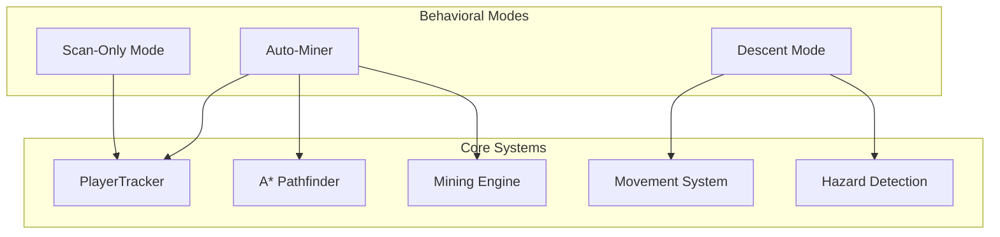
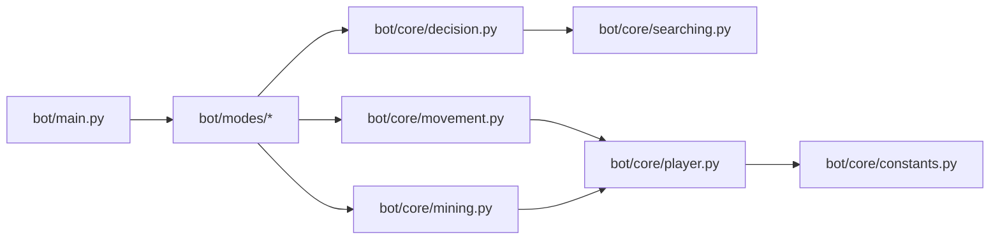
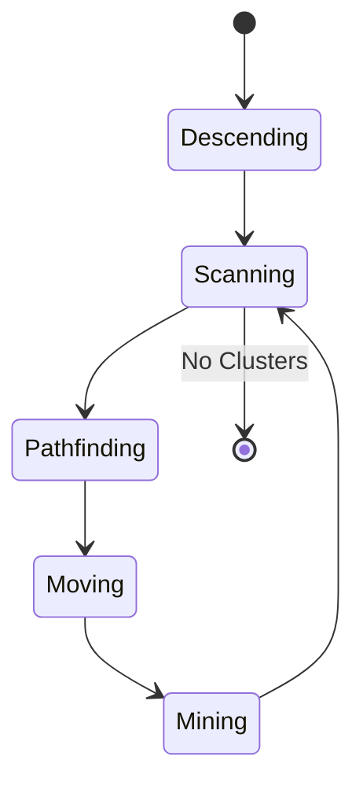

# Minecraft Auto-Miner Bot (v2.0) Architecture

This document provides a high-density technical reference for the Minecraft Auto-Miner Bot (v2.0). It covers system internals, algorithms, and engineering details for developers and researchers.

## Table of Contents
1. [System Overview](#1-system-overview)
2. [System Architecture](#2-system-architecture)
3. [Algorithmic Deep-Dive](#3-algorithmic-deep-dive)
4. [Multi-Threaded Perception System](#4-multi-threaded-perception-system)
5. [Behavioral Mode Pipelines](#5-behavioral-mode-pipelines)
6. [Safety & Failure Recovery](#6-safety--failure-recovery)
7. [Production Configuration Reference](#7-production-configuration-reference)
8. [Known Issues](#8-known-issues)

---

## 1. System Overview

The Minecraft Auto-Miner Bot (v2.0) is built on a two-layer architecture that separates low-level sensing and execution from high-level behavioral logic.

- **Core Systems (`bot/core/`)**: Responsible for player state tracking, movement primitives, pathfinding, hazard detection, and block interaction.
- **Behavioral Modes (`bot/modes/`)**: High-level state machines that compose core systems into autonomous behaviors like full mining loops or controlled descents.

The system entry point is `bot/main.py`, which implements a chat command event loop using the MineScript API.

---

## 2. System Architecture

### Module Interconnection
The bot relies on a centralized `PlayerTracker` instance (initialized in `bot/core/__init__.py`) that maintains the global state.

### Thread Architecture
The `PlayerTracker` class in `bot/core/player.py` initializes four daemon threads to handle asynchronous perception and safety:

1.  **`player_info`**: Updates every `ONE_TICK_TIME / 10` (0.005s). Tracks floored position, health, quantized yaw (cardinal directions), pitch, and rounded velocity.
2.  **`tool_in_main_hand`**: Updates every `ONE_TICK_TIME / 10`. Active only when `auto_tracking=True`. Monitors the targeted block (5-block range) and auto-swaps between `SHOVEL_SLOT` and `PICKAXE_SLOT` based on block type.
3.  **`hazard_detection`**: Updates every `ONE_TICK_TIME` (0.05s). Scans a 12-block grid (`BLOCKS_AROUND_PLAYER`) for lava and monitors `targeted_entity`.
4.  **`auto_stop_restart`**: Updates every `ONE_TICK_TIME`. A watchdog that monitors hostile entities, lava proximity, combat weapon state, health, and movement stalls. Triggers `stop()` or `restart()` sequences.

---

## 3. Algorithmic Deep-Dive

### 3.1 Shell / Frontier Expansion Search (`bot/core/searching.py`)
The search algorithm uses a multi-stage radius expansion (r=16, 20, 24, 28, 32) to locate ores. It employs a "shell" expansion technique where it only scans blocks between the current radius and the previous radius, minimizing redundant checks.
- **Max Scan Y-Level**: `MAX_SCAN_Y_LEVEL = 15` prevents excessive resource consumption by limiting vertical search.
- **Unknown Blocks**: Blocks are retrieved via `m.get_block_region` and filtered for target ores (e.g., `diamond_ore`).

### 3.2 3D Flood-Fill Ore Clustering (`bot/core/searching.py`)
Detected ore blocks are grouped into clusters using a spatial proximity check (neighbors within 1 block in any direction).
- **Cluster Data**: Each cluster stores its constituent coordinates, total size, and geometric center.

### 3.3 Priority Scoring (`bot/core/decision.py`)
Clusters are prioritized based on distance and size. 
- **Intended Formula**: `Score = (Cluster Size × 2.3) − (Distance × 1.5)` (Higher is better).
- **Actual Implementation**: The code uses a minimization approach for clusters within a 10-block range:
  $$\text{Score} = (2.3 \times \text{Distance}) - (2.3 \times \text{Cluster Size})$$
- **Note**: `CLUSTER_DISTANCE_SCORE` (1.5) is defined in `constants.py` but is currently unused in the implementation.

### 3.4 A* Pathfinder (`bot/core/decision.py`)
The pathfinder projects the 3D terrain onto a 2D walkability grid at the player's current Y-level.
- **Lava Exclusion**: Any block containing lava or adjacent to a potential lava flow is marked as non-walkable.
- **Heuristic**: Manhattan distance to the cluster center.
- **Path Buffer**: Limited to `MAX_PATH_SEARCHING_RADIUS = 24`.

### 3.5 Cluster Mining (`bot/core/mining.py`)
The `mineCluster()` function sorts cluster blocks by Y-level (descending) to ensure stability. It uses `player_look_at` and `player_press_attack` to break blocks while maintaining position.

---

## 4. Multi-Threaded Perception System

The `PlayerTracker` (in `bot/core/player.py`) is the heart of the bot's perception.

### 4.1 Player State Thread (`player_info`)
- **Updates**: Position (floored), Health, Yaw (quantized to 0, 90, 180, -90), Pitch, Velocity (5 decimal precision).
- **Stuck Detection**: Updates `_last_time_movement` whenever the floored position changes.

### 4.2 Tool Management Thread (`tool_in_main_hand`)
- **Logic**: If the targeted block (within 5 blocks) is in `SHOVEL_BREAKABLE`, it selects `SHOVEL_SLOT`. Otherwise, it defaults to `PICKAXE_SLOT`.
- **Safety**: Skips swapping if the current item is already a valid "hand item" (food, bucket, etc.).

### 4.3 Hazard Detection Thread (`hazard_detection`)
- **Lava Scan**: Uses `get_block_region` to check 12 relative positions around the player.
- **Entity Tracking**: Monitors `targeted_entity` within a 5-block range.

### 4.4 Watchdog Thread (`auto_stop_restart`)
- **Hostile Entity**: Triggers if `targeted_entity.name` does not end with "Gravel".
- **Lava**: Triggers if `lava_around` is non-empty.
- **Weapon Check**: Triggers if `main_hand_item` ends with `_sword` or `_axe`.
- **Stuck Watchdog**: If `time_stuck > 7.5s` (2.5 × `STUCK_TIMEOUT`), it triggers a `restart()` if `_restart` is enabled.

---

## 5. Behavioral Mode Pipelines

### 5.1 Auto-Miner (`bot/modes/auto_miner.py`)
The primary autonomous loop:
1.  **Descend**: Reach `STOP_Y_LEVEL` (-58).
2.  **Scan**: Locate reachable ore clusters.
3.  **Pathfind**: Generate A* path to the best cluster.
4.  **Execute**: Move to target and mine the cluster.
5.  **Repeat**: Loop until stopped or no clusters remain.

### 5.2 Descent Mode (`bot/modes/descend.py`)
A controlled vertical descent to `STOP_Y_LEVEL`.
- **Calibration**: Disables sprint and centers the player on the block.
- **Safety**: Scans environment for lava/water before each step.
- **Finalization**: Places a floor block at `FLOOR_Y_LEVEL` (-59) to ensure a stable base.

### 5.3 Scan-Only Mode (`bot/modes/scan_only.py`)
A read-only mode that reports the nearest ore cluster's position, quantity, and distance without performing any mining actions.

### 5.4 Restart Pipeline (`bot/core/restart.py`)
The `restart(cmd="\\bot\\modes\\auto_miner")` function performs a clean handover without killing the main event loop:

1. **Stop all input**: `toggle_all(False)` halts movement, attacks, and uses.
2. **Snapshot current jobs**: Captures the list of running job IDs before launching anything.
3. **Eat food**: `eat_food()` consumes from `FOOD_SLOT` (slot 5).
4. **Launch new mode**: `m.execute(cmd)` starts the specified mode (default: `\bot\modes\auto_miner`).
5. **Identify new job**: Compares new job list against the pre-launch snapshot to find the freshly spawned job ID.
6. **Error handling**: If no new job ID was found (launch failed), prints an error and returns early.
7. **Kill stale jobs**: Iterates over the pre-launch job list and kills every job **except** the main event listener (`bot\main`) and the newly launched job.

---

## 6. Safety & Failure Recovery

### 6.1 Hazard Mitigation Matrix

| Hazard | Detection Method | Threshold/Trigger | Response Action |
| :--- | :--- | :--- | :--- |
| **Hostile Entity** | `targeted_entity` scan | Name != "*Gravel" | `stop()` sequence |
| **Lava Proximity** | 12-block grid scan | `lava_around` > 0 | `lavaSave()` + `stop()` |
| **Weapon Drawn** | `main_hand_item` check | Ends with `_sword`/`_axe` | `stop()` sequence |
| **Low Health** | `player.health` | $\le 10$ | `stop()` sequence |
| **Stuck** | Positional delta | $> 7.5s$ | `restart()` sequence |
| **Falling** | `y_vel` check | $< -0.59$ | `waterDrop()` (Bucket Clutch) |

### 6.2 Descent Safety (`bot/core/safety_descend.py`)
- **`waterDrop()`**: If falling, selects `WATER_BUCKET_SLOT` (4) and spams "use" until landing.
- **`closeToLava()`**: Calculates a 3-step offset path away from detected lava.
- **`inWater()`**: Places blocks around the player to displace water and uses a bucket to clear the immediate area.

### 6.3 Mining Safety (`bot/core/safety_mining.py`)
- **`lavaSave()`**: Emergency protocol that stops inputs, finds a safe block 2 levels above, places water, and consumes food.

### 6.4 Stuck Detection (`bot/core/movement.py`)
- **Timeout #1 (3s)**: `recover_from_stuck()` re-centers the player and re-orients yaw.
- **Timeout #2 (7.5s)**: Triggers the full `restart()` pipeline.

---

## 7. Production Configuration Reference

### 7.1 User-Facing Constants
| Constant | Value | Description |
| :--- | :--- | :--- |
| `PICKAXE_SLOT` | 1 | Slot for primary mining tool |
| `SHOVEL_SLOT` | 3 | Slot for shovel |
| `WATER_BUCKET_SLOT` | 4 | Slot for water bucket |
| `FOOD_SLOT` | 5 | Slot for food items |
| `BLOCKS_SLOT` | 8 | Slot for building blocks |
| `MINING_ORE` | "diamond" | Target ore type |
| `MIN_HEALTH` | 10 | Health threshold for safety stop |
| `STOP_Y_LEVEL` | -58 | Target Y-level for mining |

### 7.2 Item Sets & Breakables
- **`SHOVEL_BREAKABLE`**: dirt, gravel, clay, grass_block, sand, soul_sand.
- **`BLOCKS_ITEM`**: cobblestone, stone, cobbled_deepslate, deepslate, diorite, granite, sandstone, tuff.
- **`PICKAXES` / `SHOVELS`**: All tiers from wooden to netherite.
- **`WEAPONS`**: Swords, axes, bows, and crossbows.

### 7.3 Physics & Timing
- **`ONE_TICK_TIME`**: 0.05s
- **`STUCK_TIMEOUT`**: 3s
- **`FALLING_Y_VEL`**: (-0.59, -3.92)
- **`MAX_WALKING_VEL`**: 0.11786

---
*Authoritative Reference for Minecraft Auto-Miner Bot v2.0*
